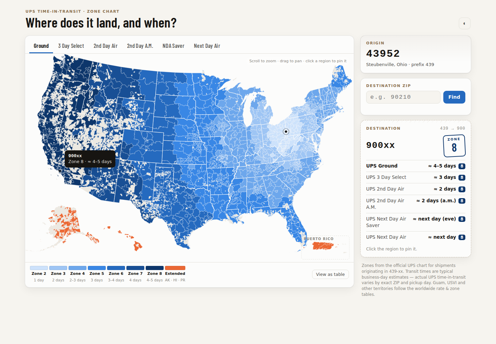
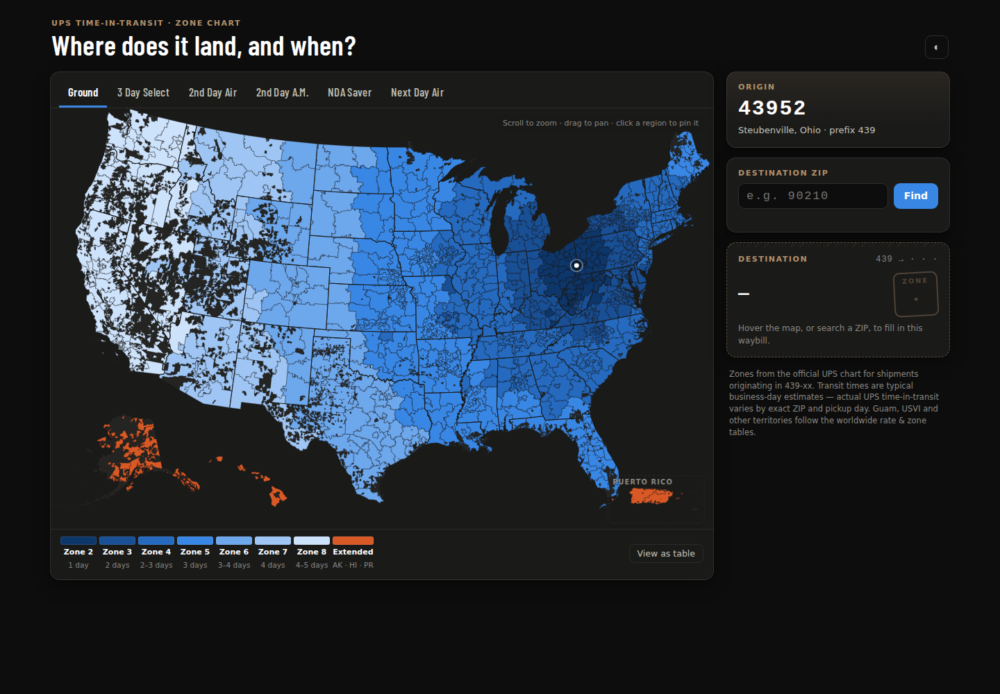
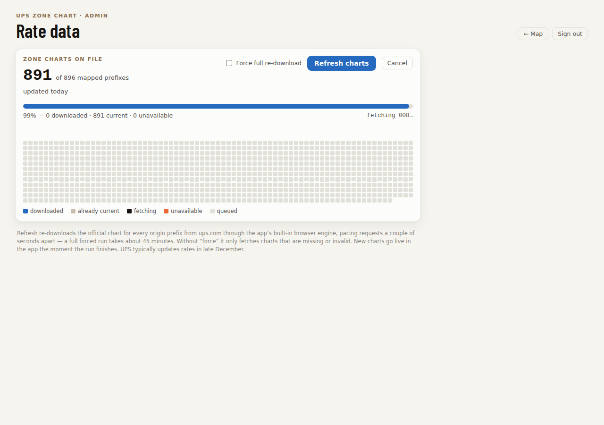
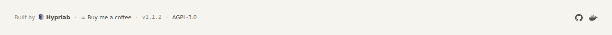

# ZoneChart

**See where it lands, and when.** ZoneChart turns UPS's per-origin zone chart
spreadsheets into an interactive US map: pick any origin ZIP, and every
3-digit destination prefix is colored by zone — light means close and fast,
dark means far and slow — with typical time-in-transit for all six UPS
services.



## Features

- **Interactive choropleth** of all US 3-digit ZIP prefixes (with AK/HI and
  Puerto Rico insets). Hover for zone + transit estimate, click to pin,
  scroll to zoom.
- **All six UPS services** — Ground, 3 Day Select, 2nd Day Air, 2nd Day Air
  A.M., Next Day Air Saver, Next Day Air.
- **Waybill panel** — a live shipping-label card showing every service's zone
  and estimate for any destination; 5-digit AK/HI ZIPs resolve their exact
  extended zones.
- **Any origin** — the complete UPS dataset (~894 origin charts) downloads
  from ups.com via the built-in admin dashboard; switch origins instantly.
- **Admin dashboard** — password-protected, with one-click dataset refresh
  and a live per-prefix progress grid. Charts go live without a restart.
- **Dark mode, mobile layout, full table view** for accessibility.

| Dark mode | Admin refresh |
|---|---|
|  |  |

## Install (docker compose)

No clone needed — save this as `docker-compose.yml` in an empty directory:

```yaml
services:
  zonechart:
    image: hyprlab/zonechart:latest
    container_name: zonechart
    ports:
      # host:container — change 8093 if that port is taken; the app always
      # listens on 8000 inside the container
      - "8093:8000"
    volumes:
      # persists downloaded zone charts and refresh state on the host, so
      # the ~45-minute dataset download happens only once
      - ./data:/data
    environment:
      # REQUIRED — protects the /admin dashboard (dataset downloads).
      # Pick something long; there is no default.
      ADMIN_PASSWORD: change-me
      # Optional — origin ZIP prefix shown when the page first loads.
      # Any 3-digit prefix you have a chart for (default: 439).
      DEFAULT_ORIGIN: "439"
    restart: unless-stopped
    healthcheck:
      test: ["CMD", "python", "-c", "import urllib.request; urllib.request.urlopen('http://localhost:8000/healthz')"]
      interval: 30s
      timeout: 5s
      retries: 3
```

Then:

```sh
docker compose up -d
```

1. Open **http://localhost:8093** — the map renders immediately with the
   bundled sample origin (439, eastern Ohio).
2. Click **Admin** (top right), sign in with your `ADMIN_PASSWORD`, and hit
   **Refresh charts**. ZoneChart downloads the official chart for every US
   origin prefix from ups.com — about 45 minutes, rate-limited, with live
   progress. It's resumable: cancel or interrupt it and the next run picks
   up where it left off.
3. Done — switch to any origin ZIP from the map's Origin card. Charts live
   in `./data/` on the host; you never download twice.

**Updating the app:** `docker compose pull && docker compose up -d` — your
charts and settings persist. **Updating the rate data** (UPS refreshes rates
each late December): Admin → check *Force full re-download* → Refresh.

### All configuration options

Set under `environment:` (or in a `.env` file if you build from source):

| Variable | Default | Purpose |
|---|---|---|
| `ADMIN_PASSWORD` | *(required)* | Protects the `/admin` dashboard. The container refuses to start without it when using the repo's compose file; the snippet above sets it inline. |
| `DEFAULT_ORIGIN` | `439` | Origin prefix (3-digit ZIP) shown on first load. |
| `CHARTS_DIR` | `/data/charts` | Where downloaded charts are stored inside the container. Keep it under the `/data` volume so charts persist. |
| `CHART_PATH` | *(bundled seed)* | Fallback single chart used when `CHARTS_DIR` is empty. Defaults to the built-in origin-439 sample; point it at your own `.xls` to change the out-of-box origin. |
| `REFRESH_STATUS_PATH` | `/data/refresh_status.json` | Where refresh progress is written. Only change if you relocate `/data`. |

### Admin settings

Beyond the dataset refresh, the `/admin` dashboard has persistent settings
(stored in `data/settings.json`, surviving upgrades):

- **Change password** — sets a hashed password that overrides the
  `ADMIN_PASSWORD` env var from then on (the env var remains only as the
  bootstrap for fresh installs). Changing it signs out every session.
- **Cloudflare Turnstile** — optionally require a human check on the sign-in
  page. Create a widget (type: managed) in your Cloudflare dashboard under
  Turnstile, then paste the site key and secret key and enable it.
  Recommended if the app is exposed beyond your LAN.
- **Origin lock** — pin the map to a single origin ZIP and hide the frontend
  "Change" button (enforced server-side too). Useful when you run ZoneChart
  for one warehouse and don't want visitors switching origins.

Locked out? Delete `admin_password_hash` (or the Turnstile keys) from
`data/settings.json` and restart — the env var password applies again.

Practical notes:

- **Resources** — idle, the app is a small Flask process; during a refresh it
  runs a headless Chromium, so allow ~500MB of headroom. The image is
  ~400MB compressed (amd64).
- **Reverse proxy** — plain HTTP on one port; anything (Caddy, Traefik,
  nginx) can front it. Put it behind HTTPS if exposed beyond your LAN — the
  admin login is a password over whatever transport you give it.
- **Backup** — the `./data` directory is the only state.

### Build from source

```sh
git clone https://github.com/hyprlab/zonechart.git
cd zonechart
cp .env.example .env        # set ADMIN_PASSWORD
docker compose up -d --build
```

## How it works

- One Flask container. Zone data comes from UPS's official per-origin
  workbooks (`Dest. ZIP prefix → zone code` per service), parsed on demand
  with an LRU cache. Map geometry (3-digit ZIP polygons, state outlines) and
  all frontend libraries are vendored — no external requests at runtime.
- The refresher drives a bundled headless Chromium via Playwright: ups.com
  sits behind bot protection that rejects plain HTTP clients, so it fetches
  charts through a real browser session. Progress streams to a status file
  the admin UI polls.
- Transit-day figures are typical business-day estimates by zone; actual UPS
  time-in-transit varies by exact ZIP and pickup day.

## Reading the map

Zones 2–8 use one blue ramp — light recedes toward the surface near your
origin, deepening with distance (the ramp flips anchor in dark mode). Orange
marks extended zones (Alaska, Hawaii, Puerto Rico); neutral gray means the
selected service isn't offered or UPS publishes no data. The white speckling
in the mountain West is real: unpopulated land with no ZIP coverage.

## Development

The stack: Flask + gunicorn, openpyxl/xlrd for parsing, D3 for the map,
Playwright + Chromium for the dataset refresher. No database — the chart
files are the data store.

## Branding & unbranded variant

The main image carries a small footer — Hyprlab attribution, a
[Buy me a coffee](https://buymeacoffee.com/hyprlab) link, the app version,
license, and repo links:



Prefer no branding? The [`unbranded`
branch](https://github.com/hyprlab/zonechart/tree/unbranded) is identical
minus the attribution and coffee link (version and license remain),
published as `hyprlab/zonechart-unbranded` on Docker Hub.

## License

[AGPL-3.0](LICENSE). ZoneChart is an independent tool, not affiliated with
or endorsed by UPS. Zone data is downloaded by each user from UPS's public
Daily Rates pages; verify critical shipments against ups.com.
